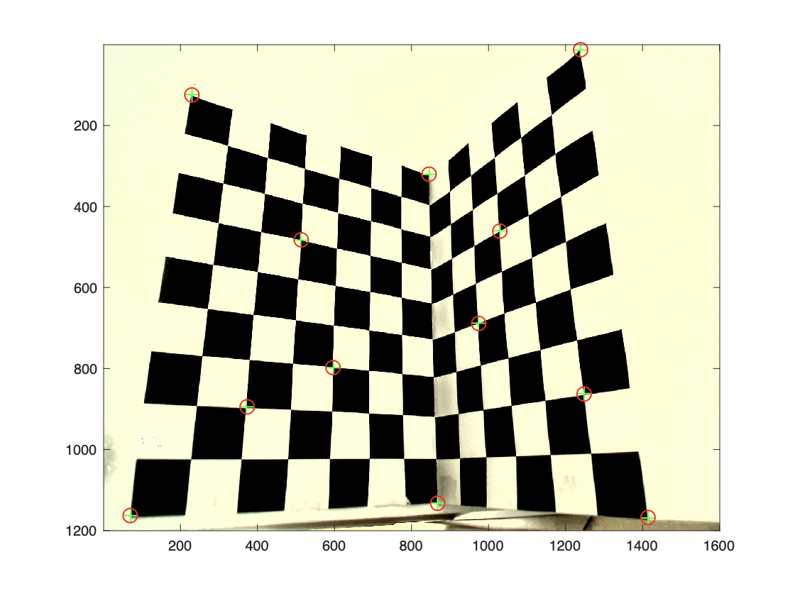
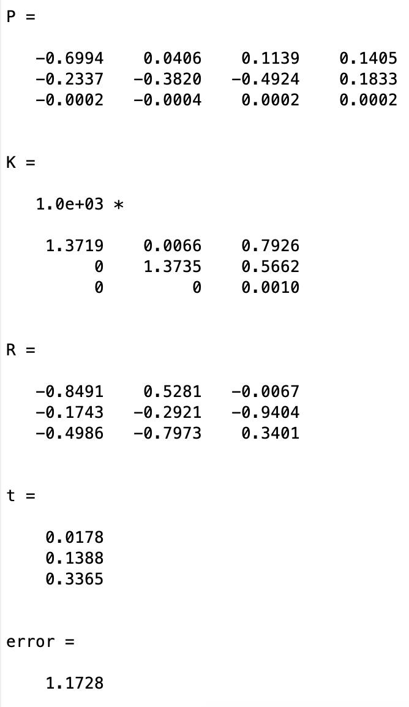
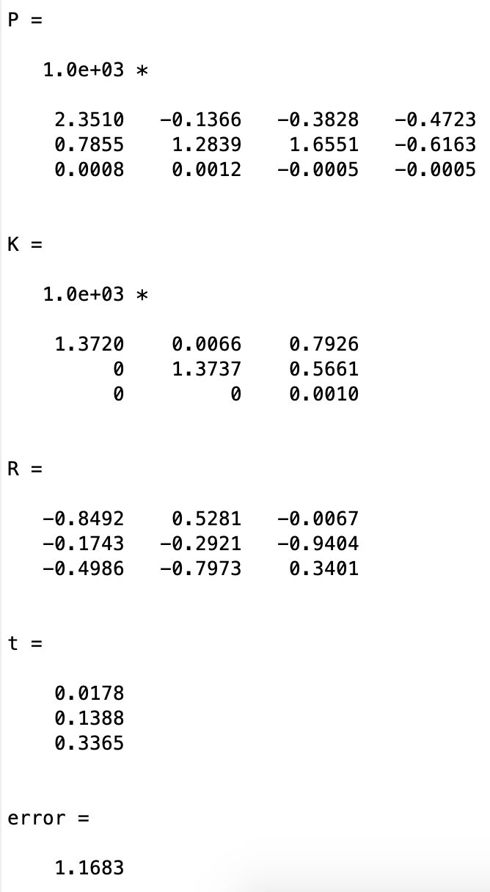
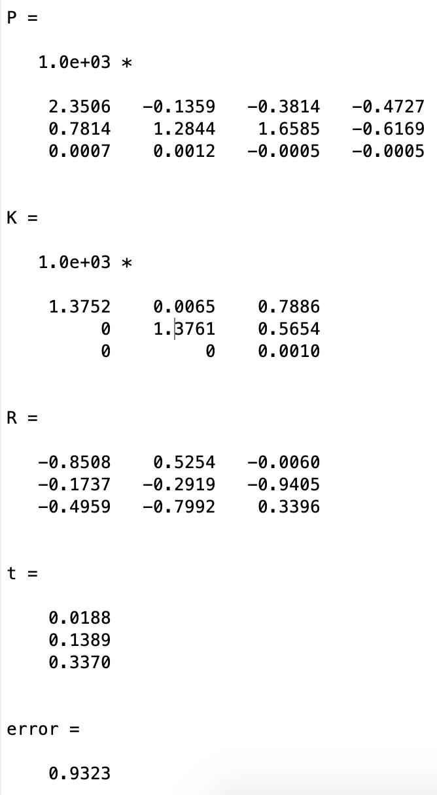

# Assignment 01: Camera calibration

### Tasks

1. Data normalization
2. DirectLinear Transform (DLT)
3. Gold Standard algorithm

### Implementation Details

- Use `getpoint.m` to select 12 sets of data points (my choice) and store in `xy.mat` and `XYZ.mat`.

- In `normalization.m`, compute centroids and scale to create transformation matrices, so that both 2D and 3D points have zero mean and unit mean distance to the origin.

- In `dlt.m`, stack the equations for all point correspondences resulting in matrix $A$; perform SVD on it: $A=USV^t$, $\hat{P} $ is the last column of $V$.

- In `decompose.m`, compute $R, K$ with QR decomposition, compute camera center $C$ s.t. $PC=0$, construct the transformation matrix $T$ s.t. $K$ has positive diagonals and multiply $R$ by $det(R)$ s.t. for new $R$, $det(R)=1$.

- In `runDLT.m`, compute DLT, denormalize the projection matrix, and factorize projection matrix into $K, R, t$.

- In `fminGoldStandard.m`, compute reprojection error and cost function as the objective function for $fminsearch$. 

- In `runGoldStandard.m`, compute DLT, minimize geometric error to refine $\hat{P} $, then similar to `runDLT.m`.

  In all, we use  `normalization.m` to normalize the 2D and 3D points, `dlt.m, decompose.m, runDLT.m` performing DLT algorithm to get the camera matrix, `dlt.m, decompose.m, fminGoldStandard.m, runGoldStandard.m` performing Gold Standard algorithm to get the camera matrix.

### Results

- Visualization of reprojected points on the calibration object with the computed camera matrix. Look similarly.

|  |  |
| :---------------------------: | :---------------------------------------------: |
|         DLT Algorithm         |             Gold Standard algorithm             |

- Computed $P, K, R, t$, and mean reprojection-error.

|  |  |   |
| :-----------------------------------: | :-------------------------------: | :------------------------------------: |
|    (a) DLT on unnormalized points     |   (b) DLT on normalized points    | (c) Gold Standard on normalized points |

Comparing (a) and (b), we find that after data normalization, the error becomes small, which showed that data normalization can improve numeric stability.

Comparing (b) and (c), we find the error of Gold Standard algorithm is smaller than that of DLT, which is reasonable, since Gold Standard starts optimization from the result of DLT.