# Assignment 02: Local Features

### Tasks

1. Harris corner detection
2. Description & Matching 
   - one-way nearest neighbors matching
   - mutual nearest neighbors matching
   - ratio test matching

### Implementation Details

Corners are the area of large intensity changes in all directions, where the changes can be defined as $E(\Delta x,\Delta y)\approx \begin{bmatrix} \Delta x & \Delta y \end{bmatrix}M\begin{bmatrix}\Delta x \\ \Delta y \end{bmatrix}$.

1. **Compute image gradients $I_x,I_y$.**

   $I_{x}(i, j)=\frac{I(i, j+1)-I(i, j-1)}{2}, I_{y}(i, j)=\frac{I(i+1, j)-I(i-1, j)}{2}$

   `Code`: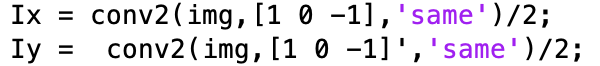

2. **Compute local auto-correlation matrix $M$ and Hrrris response function $C$**

    $M=\sum_{(x,y)\in W} w(x,y)\begin{bmatrix} I^2_x & I_xI_y\\I_xI_y & I^2_y \end{bmatrix}$ , $w$ is chosen to be Gaussian with standard deviation $\sigma$.

   $\mathcal{C}(i, j)=\operatorname{det}\left(M_{i, j}\right)-k \operatorname{Tr}^{2}\left(M_{i, j}\right)$, $k$ is empirically determined constant.

   `Code`:

    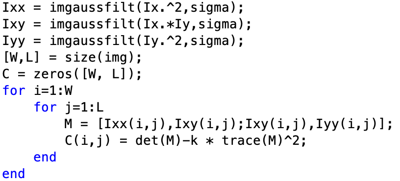

   Afterwards, the corner detection criteria for a pixel $(i, j)$ is:

   - $C(i, j)$ is above a certain detection threshold $T$, 
   - $C(i, j)$ is a local maxima in its $3\times3$ neighborhood (non-maximum suppression).

   `Code`: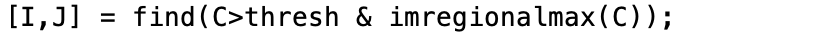

3. **Compute local descriptors**

   Since the keypoints close to the edges are also detected as corners, we need to filter them out. I simply remove the points which locate near four edges of the image and extract $9\times9$ patches around the remaining keypoints.

   `Code`:

    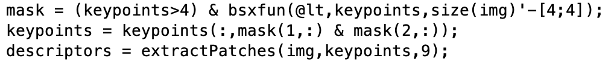

4. **SSD one-way nearest neighbors matching**

   $S S D(p, q)=\sum_{i}\left(p_{i}-q_{i}\right)^{2}$

   Compute the SSD between the descriptors of all features from image1 and image2. Then, for each feature from image1, find the closest feature from image2.

   `Code`: 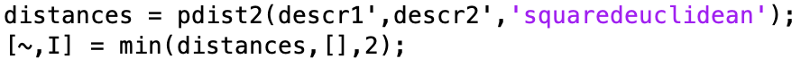

5. **Mutual nearest neighbors matching**

   Based on one-way matching, check if it's also valid if we switch image1 and image2.

   `Code`:

    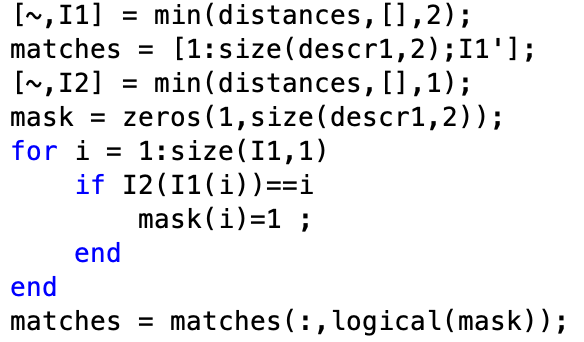

6. **Ratio test matching**

   Based on one-way matching, the matching is valid only if the ratio between the 1st and 2nd nearest neighbor distance is lower than a threshold (I choose 0.5 in the experiment).

   `Code`:

    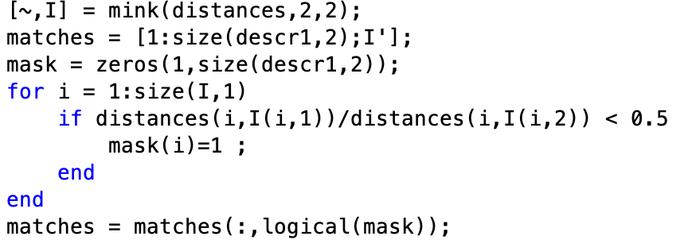

### Results

|        $\sigma=0.5$        |        $\sigma=1$         |        $\sigma=2$         |
| :------------------------: | :-----------------------: | :-----------------------: |
| 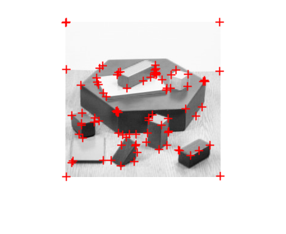 | 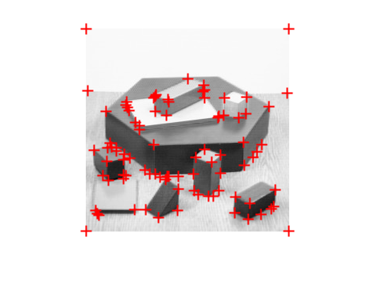 | 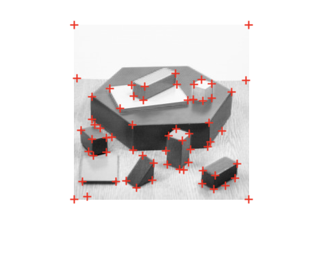 |
|        $k=4e^{-2}$         |        $k=5e^{-2}$        |        $k=6e^{-2}$        |
|  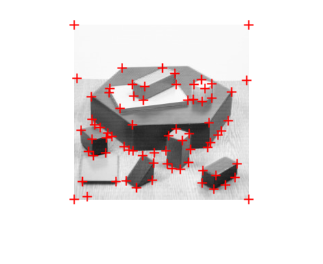   |  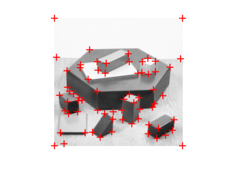  |  |
|         $T=e^{-6}$         |        $T=e^{-5}$         |        $T=e^{-4}$         |
|   |  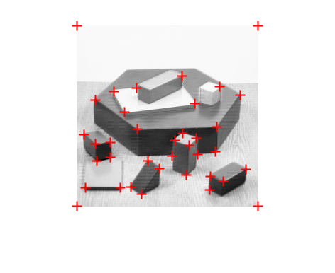  |  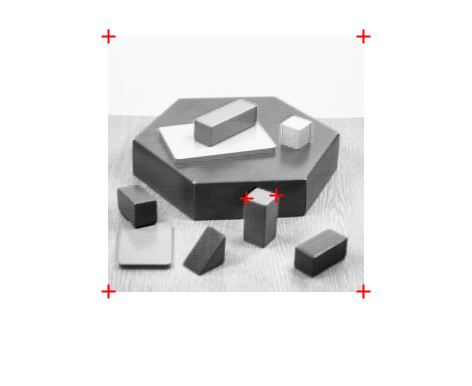  |

From the **top** row, we find when increasing  $\sigma$, most points on the line but not at corners are removed. The reason may be the larger $\sigma$ is, the more neighboring area/info are considered, the more robust the result is. From the **middle** and **bottom** row, we find the larger $k$ or $T$, the less points are detected. From the following formula, we can easily see that either increasing $k$ or $T$ will make the detection criteria harder to meet. $\mathcal{C}(i, j)=\operatorname{det}\left(M_{i, j}\right)-k \operatorname{Tr}^{2}\left(M_{i, j}\right), C(i,j)>T$. 

The following detection result are using best parameter setting: $\sigma=2,k=6e^{-2},T=1e^{-6}$.

|                          blocks.jpg                          |                         house.jpg                          |                       I1.jpg                        |                       I2.jpg                        |
| :----------------------------------------------------------: | :--------------------------------------------------------: | :-------------------------------------------------: | :-------------------------------------------------: |
|  | 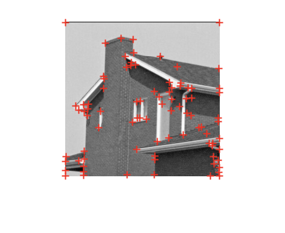 | 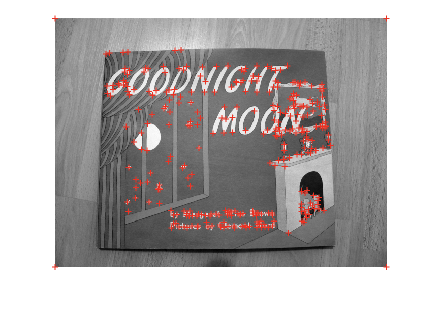 | 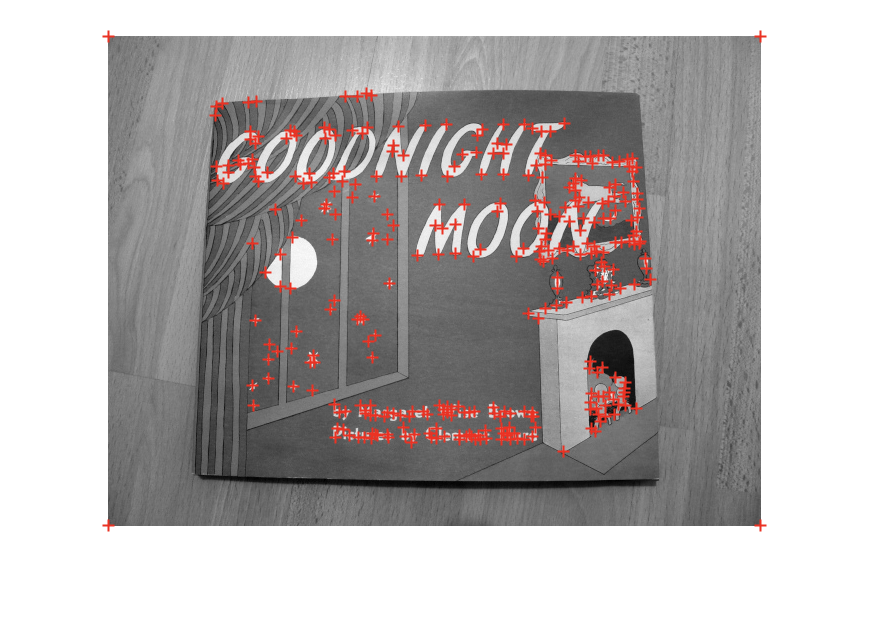 |

By looking at the above four detection results, we find most corners are detected. The **issue** is keypoints close to the edges are also wrongly detected. But in the later step, we will filter them out.

| **Matching Results using Three Matching Protocols** |
| :-------------------------------------------------: |
|      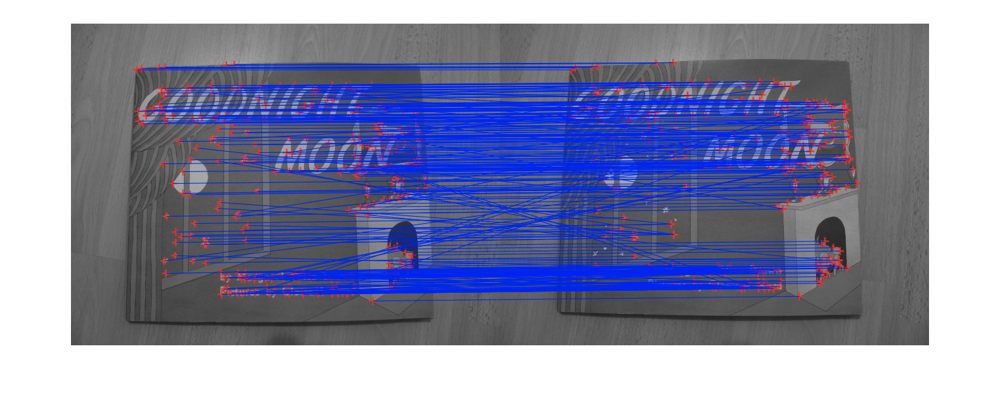      |
|     (a) SSD one-way nearest neighbors matching      |
|       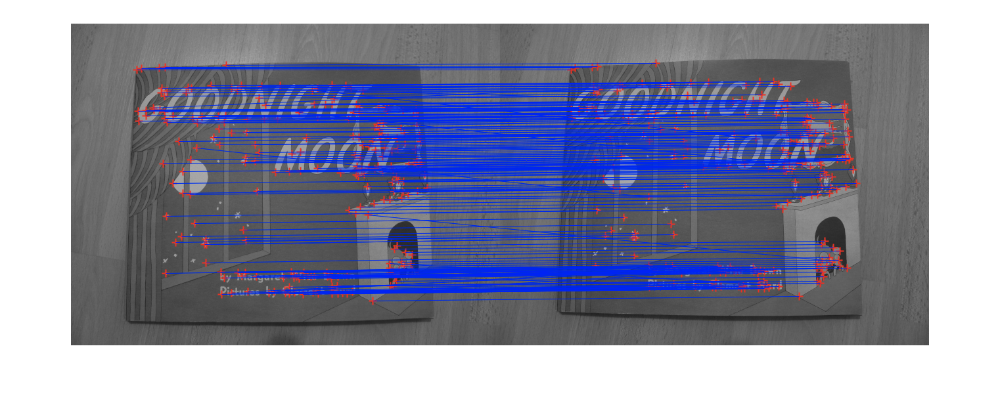       |
|        (b) Mutual nearest neighbors matching        |
|                |
|               (c) Ratio test matching               |

**Looking at (a)**, we find that most lines look parallel, only have some crossing lines, which means most matching are correct. The problem may result from local gradients, different patches may have similar gradients. **Comparing (a) and (b),** most crossing lines are removed. Since we double-check the nearest neighbors for each image, the matching correspondence are strengthened. **Comparing (a) and (c),** almost all lines are pararell now. The idea of ratio test matching is that, if two keypoints are correctly matching, their SSD should be close to zero or at least much larger than the 2nd nearest neighbor distance. So the ratio between the 1st and 2nd nearest neighbor distance will be very large. But for mismatching points, the condition does not hold.

